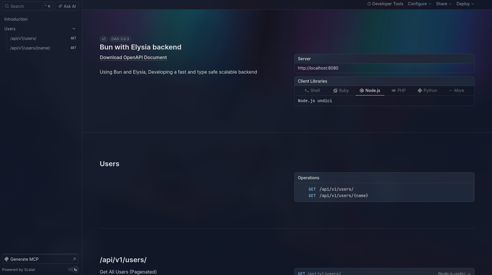
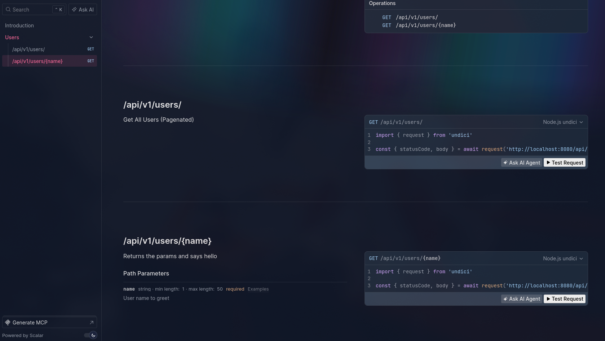

# [Elysia](https://elysiajs.com/) with [Bun](https://bun.com/) runtime

## Getting Started

To get started with this template, simply paste this command into your terminal:

```cmd
<!-- Create New Project -->
bun create elysia project-name
```

```cmd
<!-- Clone this project -->
git clone https://github.com/Zerodayu/bun-elysia-app.git
```

## Development

To start the development server run:

```cmd
bun run dev
```

#### Open <http://localhost:8080/> with your browser to see the result

<br/>

#### Open <http://localhost:8080/openapi/> to open api Documentation

> 
> 

## Features

- openApi Documentation out-of-the-box support `/openapi`
- Built-in test requests for the routes
- TypeScript first app, means type safe
- simple File Structure
